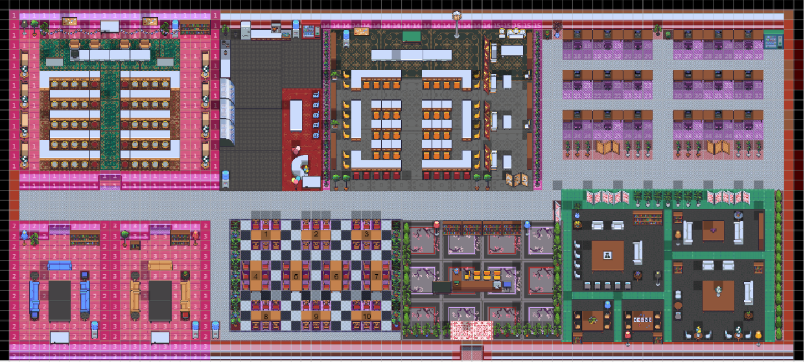

# :balance_scale: 東吳大學 X 理律學堂《2021法律科技學暑假營隊》

## :information_source: 營隊簡介
> * **營隊時間：** 2021/07/26 ～ 2021/07/30（共5天）  
> * **營隊地點：** [Gather](https://reurl.cc/dGOAnD)  
> 
> * **營隊官網：** [東吳大學 X 理律學堂 | 2021法律科技學 Gather 線上營隊](https://sites.google.com/view/lawtechscu)
> * **營隊Github：** [東吳大學 X 理律學堂 | 2021法律科技營Github](https://reurl.cc/EpMnGn)    
> * **營隊主講師：** **_蔡芸琤 Tsai, Yun-Cheng 教授_**
> * **營隊宗旨：**   
> &emsp;&emsp;鑒於在科技引爆各種變革之際，人們對於培養自己的應變力、創新力，與面對AI挑戰的競爭力有急迫的關切，而此營隊期可協助對法律科技有興趣之學生認識並使用Python對開放資料進行蒐集與整理，以利學生擴展多方面的興趣，提升終身學習的能力，進一步達到能跟上全球遠距作業的腳步，並精進從學校到職場的必備能力。

## :man_student: 第六組成員簡介
> 
> |組長|學校|就讀科系|年級|
> | :------: | :--------: |:-------: | :-----: |
> |  洪鈺姍 | 東吳大學| 企業管理學系| 延一 |
> 
> | 組員  |   學校  |  就讀科系   |   年級  |
> | :------: | :--------: |  :--------:  | :-----: |
> | 田毓慈 |  國立臺灣大學  |  科技整合法律學研究所 | 碩二 |
> | 林孟微 |  國立臺北大學  |  法律學系司法組   | 大三 |
> | 張郡庭 |  銘傳大學  |      法律學系      | 大二 |
> | 曾之筠 |  東吳大學 | 法律學系 | 大五 |

---

## :checkered_flag: 迷你黑客松簡介
* ***營隊發表會目標：** 所有學員皆能把自己的想法實際寫出來，以達到知行合一。*  
### :bulb: 黑客松【第六組】專案題目
> * **專案名稱：** 【一杯下肚，賠一輩子，以杯數預測量刑。】
> * **團隊名稱：** 啤於奔命
> * **[專題日誌](https://reurl.cc/nEjnal)：** 專案從無到有的發想收斂過程，以及遇到的問題及處理結果。
> * **創作理念：**  
>   * **司法負擔沉重影響判決品質**：即使修法之後酒駕案件仍時時頻傳，不只危害到民眾的生命安全，更使法官、檢察官等司法人員的負擔日益沉重，進而影響到法院判決的品質。
>   * **使預防酒駕觀念融入生活**：民眾對於「酒測值」的概念相對薄弱，使其容易產生僥倖心理，進而犯下酒駕的刑責，然若是一昧地提高刑責，此舉動自犯罪學的角度而言，實證上並無十分顯著的效果，反而容易淪為有心人利用的工具，故應要將酒測的觀念從源頭融入普羅大眾的意識生活裡，進而達到預防勝於治療的效果。
>   * **加強推廣法治教育**：許多民眾並不真正清楚了解到酒駕的代價有多嚴重，故希望可以藉此加大推廣力度以達到法治教育普羅。
> * **實作流程：**  
>   1. 爬蟲：爬取相關所需網站資料的內容，以取得分析的數據來源。
>   2. 資料清洗與整理：獲取發生月份、量刑刑期、酒測值，以後續分析利用。
>   3. 建立使用者入口：將前述的因子納入使用者端口並連結量刑刑度。
>   4. 資料視覺化：視覺化分析結果，並連結相關背後的法律意義。  

### :star2:【刑酒器APP】專案成果
> * Logo  
> 
>   * 設計理念：以「刑責」與「酒精」二字取字首合併命名，體現出專案的兩大元素以及推廣法治教育的初衷，目的為達到讓使用者可以醒酒，達到喝酒不開車，開車不喝酒的教育警世作用。
>   * 設計元素：由【黃色】（啤酒跟氣泡）、【紅色】（血液）、【藍色】（酒測吹氣）、以及【黑色】（手銬及牢獄之災）四種元素相互交錯。  
> * Code  
>
> | 程式碼 | 說明 |   
> | :-----: | :-------- |
> |[Crawling](./一杯下肚，賠一輩子，以杯數預測量刑。/code/Crawling.ipynb)|爬取司法院裁判書系統（駕駛動力交通工具而吐氣所含酒精濃度）、酒經濃度相關網站。|  
> |[Data_Mining](./一杯下肚，賠一輩子，以杯數預測量刑。/code/Data_Mining.ipynb)|原始資料清洗整理，並將裁判日期分隔出月份、將裁判內文分隔出量刑刑期以及分離出酒測值。|  
> [input_output](./一杯下肚，賠一輩子，以杯數預測量刑。/code/input_output.ipynb)|設立輸入通道，將飲酒量與估算酒測值、酒醉程度、肇事率及量刑刑度連結。|
> |[Data_Visulaization](./一杯下肚，賠一輩子，以杯數預測量刑。/code/Data_Visulaization.ipynb)|繪製量刑刑期與酒測值的視覺圖，並賦予隱含的法律意義。|
> 
> * Report
> 
> | 成果 | 說明 |   
> | :-----: | :-------- |
> |[PPT](./一杯下肚，賠一輩子，以杯數預測量刑。/report/刑酒器APP_呼氣酒精濃度預測量刑系統.pdf)|黑客松成果發表會專題簡報|
> |[Figma](https://reurl.cc/Q9kVkO)|腦海預想的刑酒器APP的使用成果展現| 
> |[Presentation](https://youtu.be/zPB1LGj_R4k)|2021/07/30黑客松成果發表會當日第六組的網路實時錄影|
 

